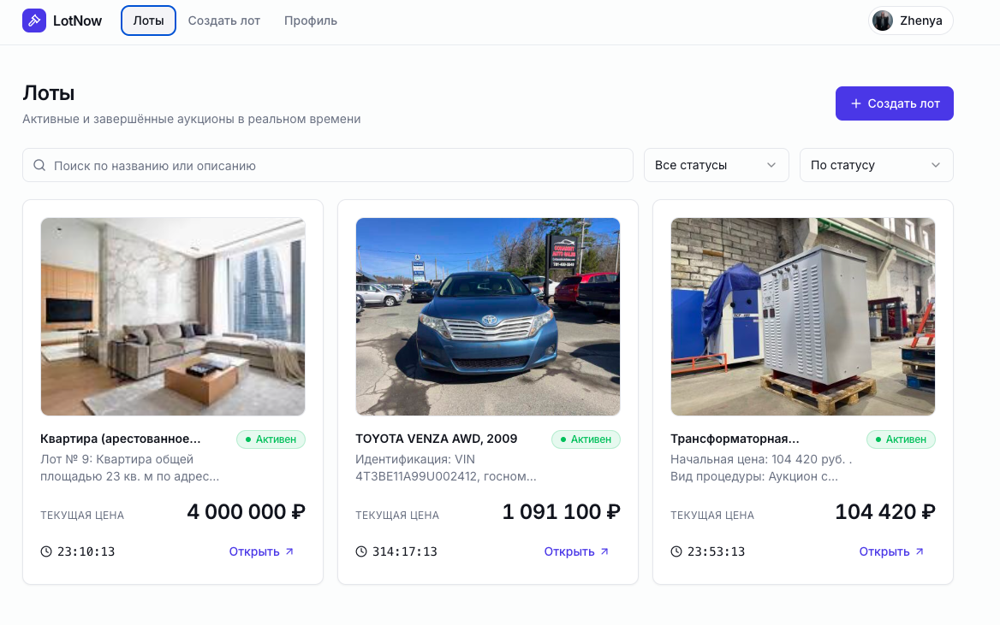
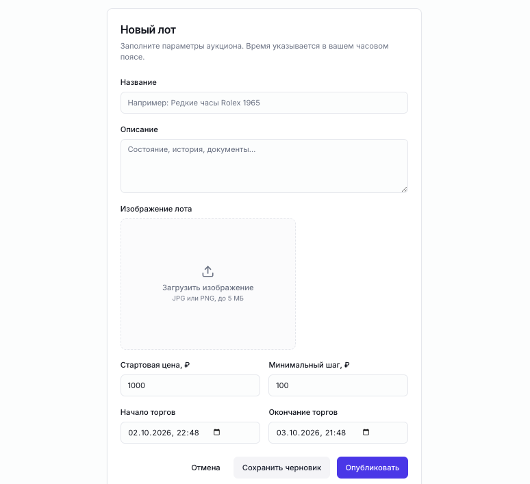
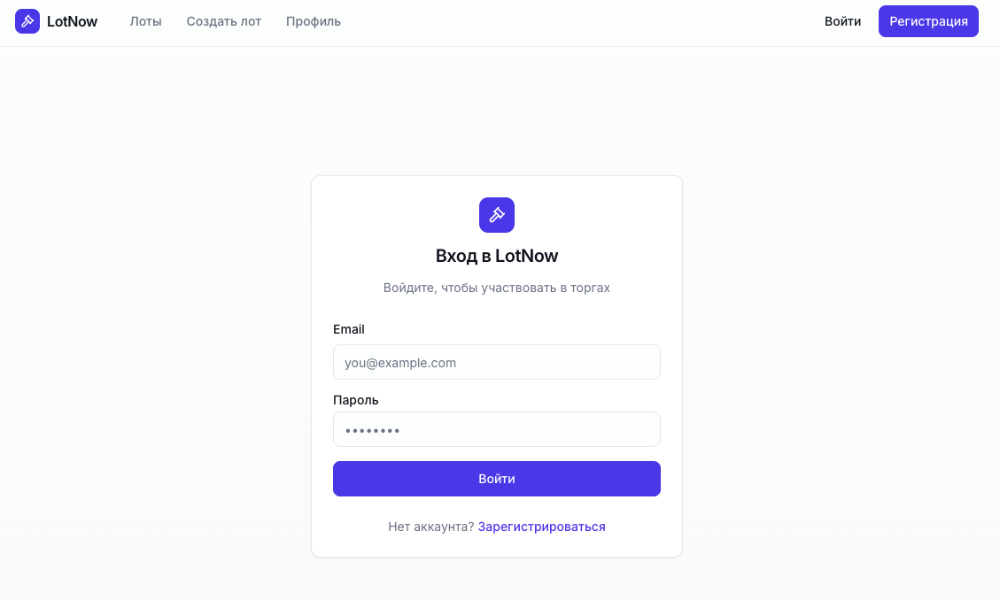
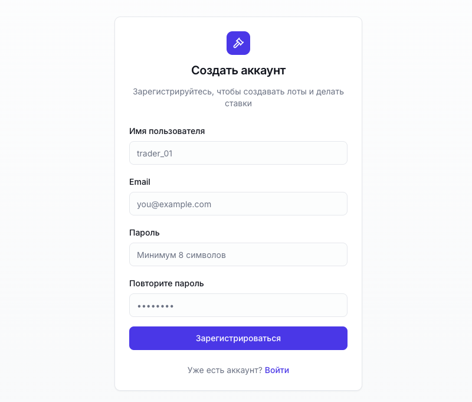

# LotNow

### Real-time Auction Platform

**LotNow** is a full-stack real-time auction platform where users can create auction listings, browse available lots, place bids, and track auction activity.

The project focuses heavily on backend development with **Python, FastAPI, PostgreSQL and SQLAlchemy**, and is deployed using **Docker Compose and Nginx**.

## Live Demo

### 🌐 [Open LotNow](https://lots.warp-jump.ru/lots)

The application is deployed on a remote Linux server and served through **Nginx with HTTPS**.

---

## Features

### 👤 Authentication

* User registration
* User login
* JWT-based authentication
* Secure password hashing with Argon2
* Protected API endpoints

### 🏷️ Auctions

* Create auction listings
* Browse available lots
* View auction details
* Search auctions
* Track auction status
* Automatic auction completion

### 💰 Bidding

* Place bids on active auctions
* Validate bidding requests
* Track current auction state
* Prevent invalid bids

### 🔧 Backend

* REST API built with FastAPI
* Request and response validation with Pydantic
* PostgreSQL database
* SQLAlchemy ORM
* Database migrations with Alembic
* Authentication and authorization
* Business logic separated from API layer

### 🚀 Deployment

* Dockerized application
* Docker Compose
* Nginx reverse proxy
* HTTPS / SSL
* Linux server deployment

---

## Tech Stack

### Backend


* Python
* FastAPI
* Pydantic
* SQLAlchemy
* Alembic
* Uvicorn

### Database


* PostgreSQL
* Relational database design
* SQLAlchemy ORM
* Database migrations with Alembic

### Authentication

* JWT
* Argon2
* Password hashing
* Protected API routes

### Infrastructure


* Docker
* Docker Compose
* Nginx
* Linux
* HTTPS / SSL

### Frontend

* Next.js
* React
* TypeScript
* Tailwind CSS
* React Query
* React Hook Form
* Zod

---

## Architecture

The application is organized around separate frontend, backend and database services.

```text
                         Internet
                            │
                            ▼
                      ┌───────────┐
                      │   Nginx   │
                      │ HTTPS /   │
                      │ Reverse   │
                      │  Proxy    │
                      └─────┬─────┘
                            │
                 ┌──────────┴──────────┐
                 │                     │
                 ▼                     ▼
          ┌─────────────┐       ┌─────────────┐
          │   Frontend  │       │   FastAPI   │
          │   Next.js   │──────▶│   Backend   │
          └─────────────┘       └──────┬──────┘
                                       │
                                       ▼
                                ┌─────────────┐
                                │ PostgreSQL  │
                                └─────────────┘
```

The services are managed with Docker Compose.

---

## Backend Structure

The backend follows a modular structure separating API endpoints, schemas, models and application logic.

```text
backend/
├── app/
│   ├── api/
│   ├── models/
│   ├── schemas/
│   ├── services/
│   └── ...
├── migrations/
├── alembic.ini
└── ...
```

The structure is designed to keep HTTP handling, validation, database access and business logic separated.

---

## API

The backend exposes a REST API built with FastAPI.

Interactive API documentation is available through:

```text
/docs
/redoc
```

For a local development environment:

```text
http://localhost:<backend-port>/docs
```

Swagger UI can be used to inspect available endpoints and test API requests.

---

## Database

PostgreSQL is used as the primary relational database.

The application uses SQLAlchemy as an ORM and Alembic for database migrations.

Main entities include concepts such as:

* Users
* Auctions
* Bids
* Auction status
* Auction ownership

Database schema changes are managed through migrations rather than manually modifying the database.

---

## Authentication

Authentication is implemented using JWT tokens.

The authentication flow includes:

```text
Register
   │
   ▼
Password hashing
   │
   ▼
Login
   │
   ▼
JWT token
   │
   ▼
Protected API endpoints
```

Passwords are hashed using **Argon2** rather than being stored in plain text.

---

## Deployment

The application is deployed on a Linux server using Docker Compose.

Production traffic is handled by Nginx:

```text
Client
  │
  │ HTTPS
  ▼
Nginx
  │
  ├── Frontend
  │
  └── Backend API
          │
          ▼
      PostgreSQL
```

The deployment setup includes:

* Docker containers
* Docker Compose
* Nginx reverse proxy
* HTTPS
* SSL certificates
* PostgreSQL
* Remote Linux server

---

## Running Locally

### Requirements

* Docker
* Docker Compose
* Git

### Clone the repository

```bash
git clone https://github.com/Eugen1204/LotNow.git
cd LotNow
```

### Configure environment variables

Create the required environment files according to the project configuration.

Example:

```env
POSTGRES_DB=lotnow
POSTGRES_USER=postgres
POSTGRES_PASSWORD=your_password

DATABASE_URL=postgresql://postgres:your_password@db:5432/lotnow

SECRET_KEY=your_secret_key
```

> Do not commit real passwords, secret keys or other credentials to the repository.

### Start the application

```bash
docker compose up --build
```

After the containers start, open the application using the configured frontend port.

---

## Screenshots

### Auction List



### Auction Details


### Create Auction



### Authentication



### Registration



---

## Project Goals

LotNow was built as a practical backend-focused project to gain experience with real-world application development.

The main areas of practice were:

* Designing REST APIs with FastAPI
* Building a modular Python backend
* Working with PostgreSQL
* Designing relational database models
* Using SQLAlchemy ORM
* Managing database migrations with Alembic
* Implementing JWT authentication
* Secure password hashing with Argon2
* Implementing auction and bidding business logic
* Request and response validation with Pydantic
* Containerizing applications with Docker
* Deploying an application to a Linux server
* Configuring Nginx as a reverse proxy
* Setting up HTTPS

---

## Project Status

🟢 **Deployed and functional**

The project is currently available online and can be tested through the live demo.

Some parts of the project may continue to evolve as new backend features and improvements are added.

---

## Links

🌐 **Live Demo:**
https://lots.warp-jump.ru/lots

💻 **GitHub Repository:**
https://github.com/Eugen1204/LotNow

---

## Author

**Eugen**

Python Backend Developer

[GitHub](https://github.com/Eugen1204)
